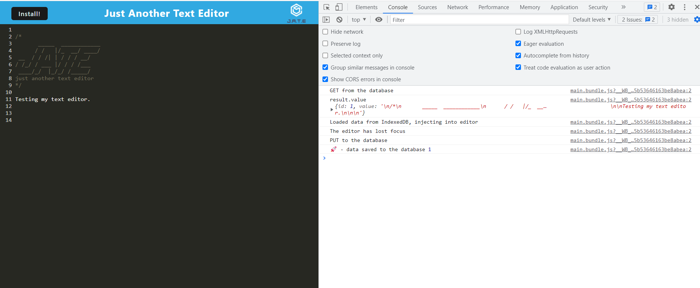
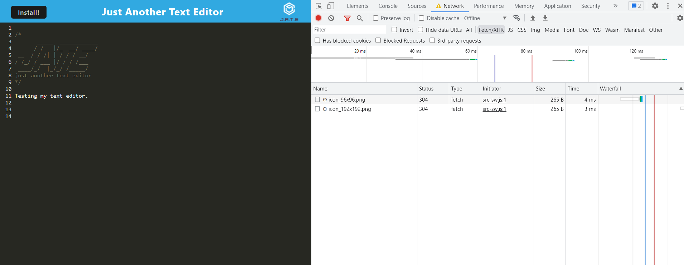

# Title

- PWA-Challenge-Text-Editor

## Table of Contents

- [Title](#title)
- [Description](#description)
- [User Story](#user-story)
- [Installation](#installation)
- [Technology Used](#technology-used)
- [Test](#test)
- [Links](#links)
- [License](#license)

## Description

- The application is a web text editor where the user can create notes or code snippets with or without an internet connection and where the user can reliably retrieve them for later use.
- The integrated service worker and Cache API's ensure that the application will remain fully functional even without internet connection.
- Also, this application allows the user to access visited pages even if the application is offline.

## User Story

- AS A developer
- I WANT to create notes or code snippets with or without an internet connection,
  SO THAT I can reliably retrieve them for later use.

## Installation

- Clone the App into your local machine.
- Delete the dist folder.
- npm i
- npm run build.
- npm run start:dev and run locally.
- Also (OR), you can run this App using the "URL of App Link" from the "Links" section at the bottom.

## Technology Used

- npm install express (express.js)
- npm install --save-dev webpack (Webpack)
- npm install webpack-dev-server --save-dev (webpack-dev-server)
- npm install --save-dev webpack-pwa-manifest (WebpackPwaManifest)
- npm install babel (Babel)
- npm install --save-dev css-loader (CSS-loader)
- npm install concurrently --save (run multiple commands concurrently.) (Concurrently)
- npm install idb (IndexedDB)

## Test

- Testing of this application could be: `locally at  http://localhost:3000/` OR
- On the Links section click `URL Heroku App Link` to start the browser.
- Regularly, clear site data is required on local storage upon testing offline.

## Links

- [URL of GitHub Repository](https://github.com/Tesfa8186/PWA-Challenge-Text-Editor)
- [URL of Heroku App Link](https://stark-atoll-29817.herokuapp.com/)
- [URL of Heroku App Dashbouard link](https://dashboard.heroku.com/apps/stark-atoll-29817)
-
- 
- 

## License

- Coverd by 
